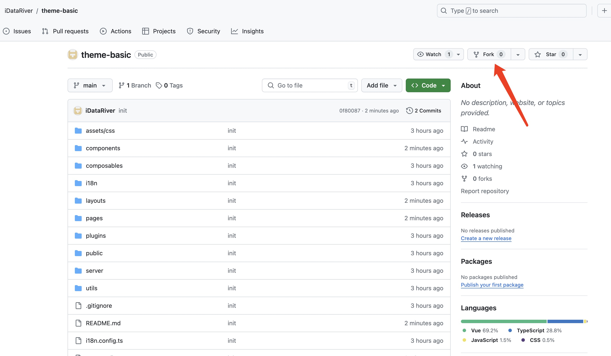
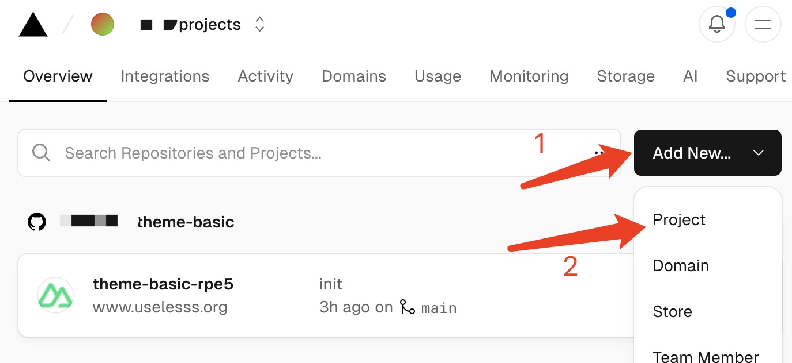
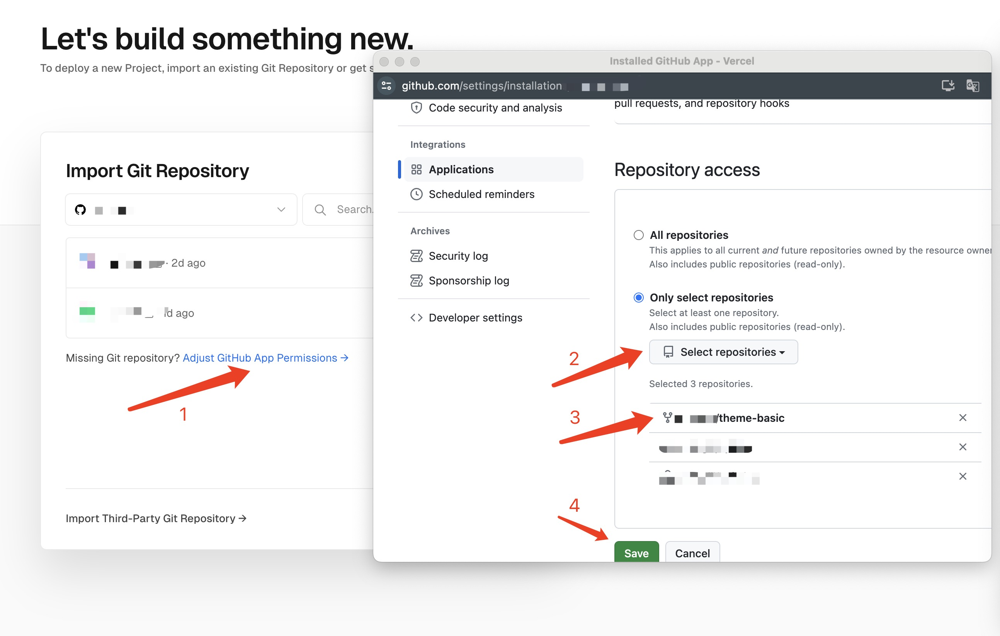
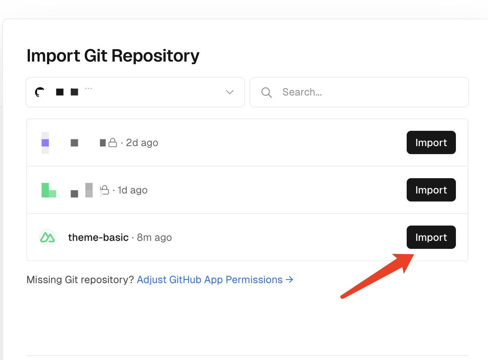
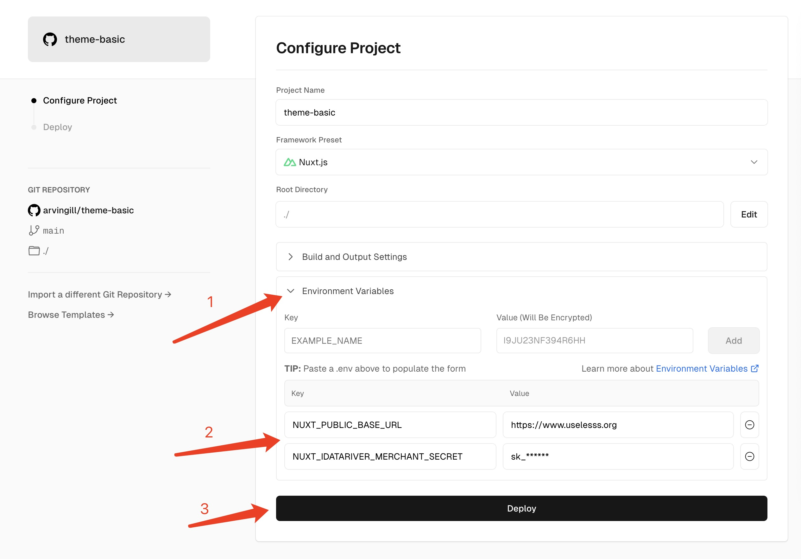
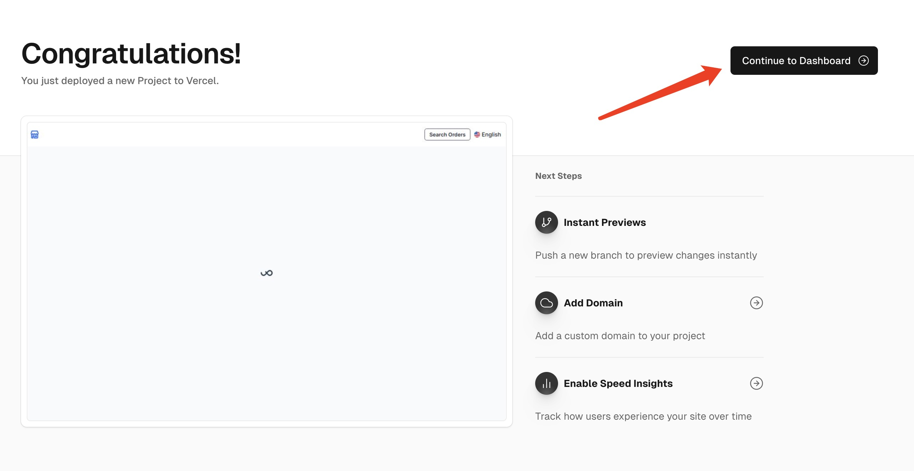
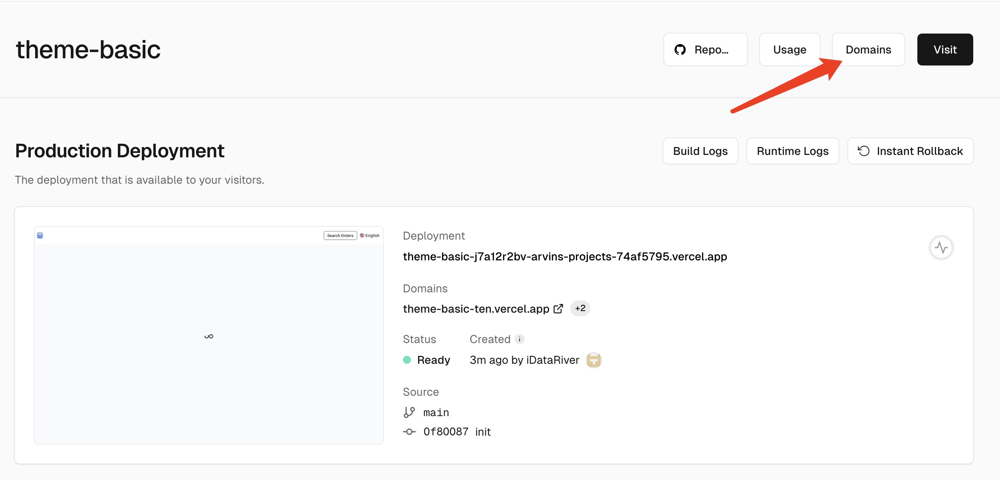
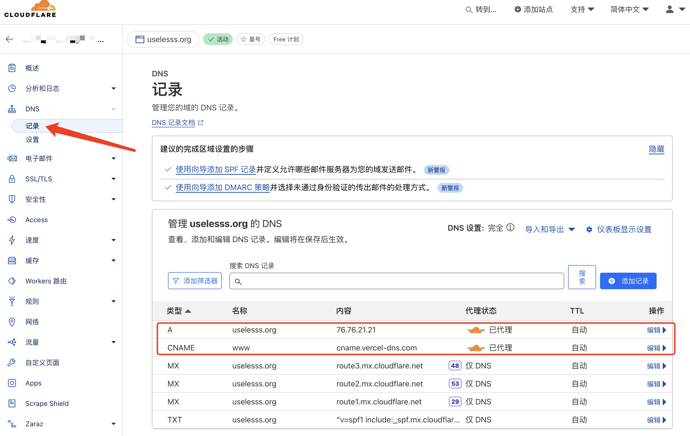
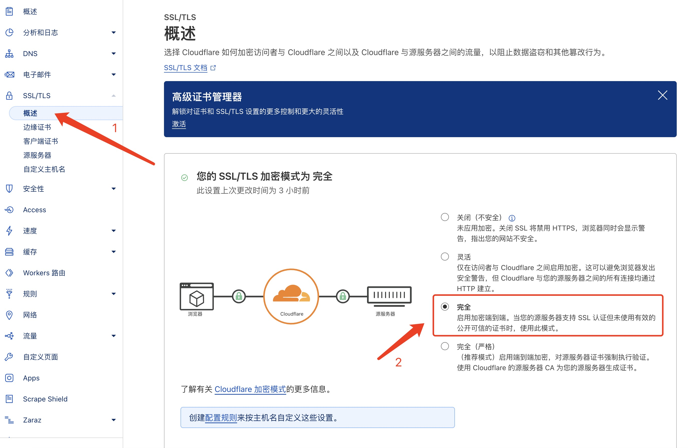

En [中文](./README_CN.md)

<h1 align="center">iDataRiver Theme(Basic)</h1>

This project is an open-source independent website project by [`iDataRiver`](https://www.idatariver.com).

For project/product management, please go to `iDataRiver` `Console` -> `Project Management`.

[Business Guide](https://docs.idatariver.com/guide/04.01.merchant.html) / [Demo](https://uselesss.org/) / [Issues](https://github.com/iDataRiver/theme-basic/issues)

## Community

* Telegram Merchant Group: https://t.me/idatariver_merchant
* Discord Channel: https://discord.gg/Ag7EUvhub5

## Features

### Supported by iDataRiver's backend capabilities
This project is connected to the merchant open API of the `iDataRiver` platform, so it can directly use the data + payment + risk control + security capabilities provided by `iDataRiver`.

Merchants only need to configure it in the console to use it directly, without having to face the complex and costly underlying implementation.

### SEO optimization
The project uses SSR (server-side rendering) technology, so search engines can better index website info.

### Highly flexible custom script support
Merchants can add custom JS scripts in the console to greatly increase functional flexibility.

### Automatic support for global multi-language translation
Not only does the project itself support multiple languages, it also supports intelligent translation of project/product descriptions into 18 languages ​​by default, making your business truly global.

### First-level agent function
The project is fully compatible with the agent function of the platform merchants. For detailed introduction, see [document](https://docs.idatariver.com/guide/04.07.affiliates.html).

### Provide basic API encryption
Provides basic API signature encryption functions and also supports merchants to customize signature secret, effectively increasing the threshold for attacks such as ddos.

### Secondary development
For developers, you can read [Merchant Open API](https://docs.idatariver.com/guide/04.06.developer.html) for secondary development.

## Deploy

This project is developed based on `Nuxt3` and can be directly deployed on platforms such as `Vercel`.

If you have no deployment experience, you can choose [Quick Deployment Solution](https://docs.idatariver.com/guide/04.10.website.html).

If you have some deployment experience, you can manually deploy it according to the following steps:

### 1. Fork this project to your own `Github` account

### 2. Register a [`Vercel account`](https://vercel.com/), bind the `Github` account in step 1, and authorize access to the forked project

The `Vercel` account needs to be bound to your mobile phone number. You can use our [SMS Service](https://www.idatariver.com/app/sms-helper) to protect your privacy.

### 3. Create a new project in the Vercel console and import the project from step 2:

Create a project on Vercel

Add project access permissions

Import the project to be deployed

Start deploying the project and set the following environment variables:

#### `NUXT_IDATARIVER_MERCHANT_SECRET`
Deployment secret, this parameter must be filled in, which can be obtained after configuration in `Merchant Settings` -> `Website` of the [`iDataRiver Console`](https://www.idatariver.com/console/merchant/settings).

#### `NUXT_PUBLIC_API_ENCRYPT_KEY`
Optional parameter, used to customize the encryption signature at the API level to obtain better security protection, and its value can be set by yourself.

After setting the above environment variables, click `Deploy` to deploy, and wait for about a minute for your website to be successfully deployed.

### 4. Bind domain name

> If you don't have a domain name yet, it is strongly recommended to use the [Simple Domain Name service](https://www.idatariver.com/app/domain) provided by `iDataRiver` to fully protect your privacy.

After the deployment is successful, click the `Domains` and follow the specified operations.

Add your domain name:

Finally, add the corresponding DNS records to the domain name.

#### Use CloudFlare to host your domain

You can use [`CloudFlare`](https://www.cloudflare.com/) to host your domain for free, you need to configure it as follows:

After adding the DNS records required by Vercel (proxy mode).

Set the domain's `SSL/TLS` to `full` end-to-end encryption

### 5. Finally
Now, your website has been successfully deployed and launched.

If you need to upgrade to the latest version after a period of time, there are two ways:

1. Delete the original project in `Vercel`, and then follow the above steps again.

2. Manually `Sync` the project you `fork` on `Github`, and then manually trigger a deployment in `Vercel`.
